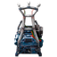
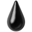
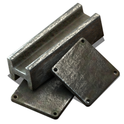

# Vanilla Look: Krastorio 2

## Summary

This MOD _selectively_ restores vanilla look of some items, recipes and technologies which are changed in Krastorio 2.

## Difference of icons between Vanilla and Krastorio 2

### Items

||Vanilla | Krastorio 2|
|-|-|-|
|Iron plate|||
|Copper plate|||
|Steel plate|||
|Iron gear wheel|||
|Electronic circuit|||
|Advanced circuit|||
|Processing unit|||
|Electric mining drill|||
|(Oil) Pumpjack|||
|Substation|||
|Atomic bomb|||
|Artillery shell|||

### Fluid

||Vanilla | Krastorio 2|
|-|-|-|
|Water|||
|Steam|||
|Crude oil|||
|Petroleum gas|||
|Light oil|||
|Heavy oil|||
|Sulfuric acid|||
|Lubricant|||

### Recipes

||Vanilla | Krastorio 2|
|-|-|-|
|Coal liquefaction|||

### Technologies

||Vanilla | Krastorio 2|
|-|-|-|
|Logistics|||
|Oil processing|||
|Coal liquefaction|||
|Steel axe|||
|Steel processing|||
